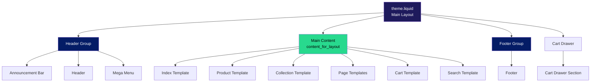
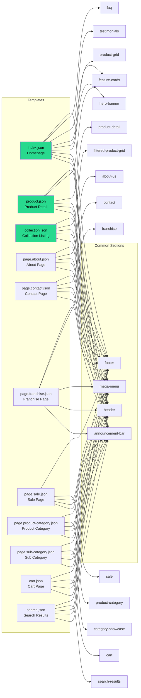
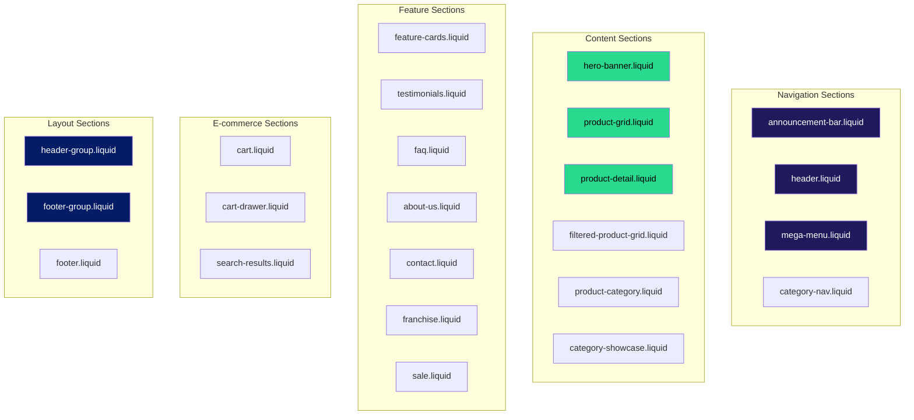
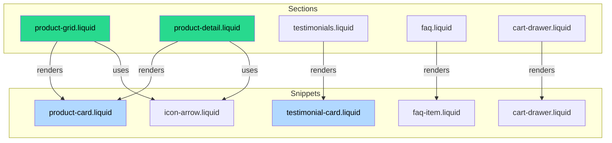
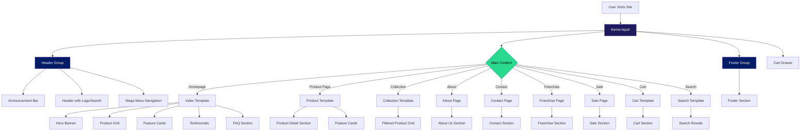
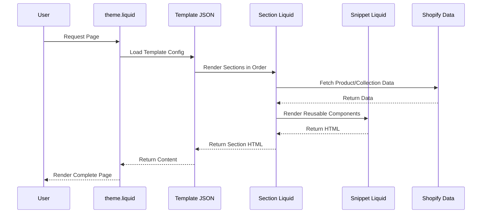
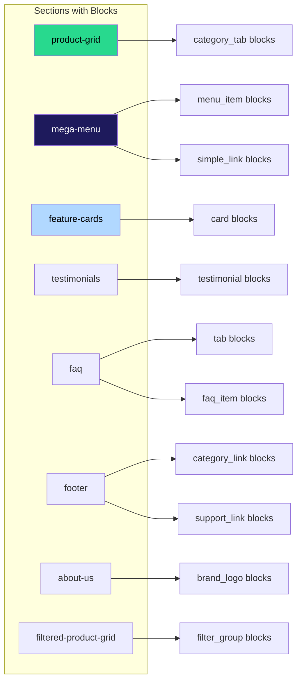
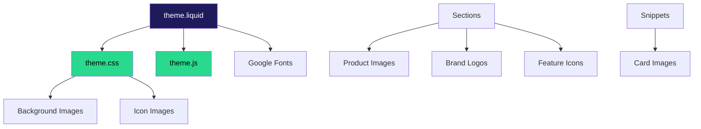

# Shopify ReGuru Theme Architecture

This document provides visual diagrams of the Shopify theme structure using Mermaid diagrams.

## Table of Contents
1. [Overall Architecture](#overall-architecture)
2. [Template Structure](#template-structure)
3. [Section Organization](#section-organization)
4. [Component Relationships](#component-relationships)
5. [File Structure](#file-structure)

---

## Overall Architecture

---

## Template Structure

---

## Section Organization

---

## Component Relationships

---

## File Structure

```mermaid
graph TD
    ROOT[shopify-reguru/] --> LAYOUT[layout/]
    ROOT --> TEMPLATES[templates/]
    ROOT --> SECTIONS[sections/]
    ROOT --> SNIPPETS[snippets/]
    ROOT --> ASSETS[assets/]
    ROOT --> CONFIG[config/]
    ROOT --> LOCALES[locales/]
    
    LAYOUT --> L1[theme.liquid]
    
    TEMPLATES --> T1[index.json]
    TEMPLATES --> T2[product.json]
    TEMPLATES --> T3[collection.json]
    TEMPLATES --> T4[page.*.json]
    TEMPLATES --> T5[cart.json]
    TEMPLATES --> T6[search.json]
    
    SECTIONS --> S1[announcement-bar.liquid]
    SECTIONS --> S2[header.liquid]
    SECTIONS --> S3[mega-menu.liquid]
    SECTIONS --> S4[hero-banner.liquid]
    SECTIONS --> S5[product-grid.liquid]
    SECTIONS --> S6[product-detail.liquid]
    SECTIONS --> S7[filtered-product-grid.liquid]
    SECTIONS --> S8[feature-cards.liquid]
    SECTIONS --> S9[testimonials.liquid]
    SECTIONS --> S10[faq.liquid]
    SECTIONS --> S11[about-us.liquid]
    SECTIONS --> S12[contact.liquid]
    SECTIONS --> S13[franchise.liquid]
    SECTIONS --> S14[sale.liquid]
    SECTIONS --> S15[footer.liquid]
    SECTIONS --> S16[cart.liquid]
    SECTIONS --> S17[search-results.liquid]
    SECTIONS --> S18[header-group.liquid]
    SECTIONS --> S19[footer-group.liquid]
    
    SNIPPETS --> SN1[product-card.liquid]
    SNIPPETS --> SN2[testimonial-card.liquid]
    SNIPPETS --> SN3[faq-item.liquid]
    SNIPPETS --> SN4[cart-drawer.liquid]
    SNIPPETS --> SN5[icon-arrow.liquid]
    
    ASSETS --> A1[theme.css]
    ASSETS --> A2[theme.js]
    ASSETS --> A3[*.png images]
    
    CONFIG --> C1[settings_data.json]
    CONFIG --> C2[settings_schema.json]
    
    LOCALES --> LOC1[en.default.json]
    
    style ROOT fill:#1e1a5c,color:#fff
    style LAYOUT fill:#041c66,color:#fff
    style TEMPLATES fill:#28d98e,color:#000
    style SECTIONS fill:#b1d8ff,color:#000
    style SNIPPETS fill:#b1d8ff,color:#000
```

---

## Page Flow Diagram

---

## Data Flow

---

## Section Block Structure

---

## Asset Dependencies

---

## Notes

- **theme.liquid** is the root layout file that wraps all pages
- **Templates** (JSON files) define which sections appear on each page type
- **Sections** are reusable page components that can have blocks
- **Snippets** are smaller reusable components rendered within sections
- **Header Group** and **Footer Group** are special sections that wrap header/footer content
- All templates share common sections (announcement-bar, header, mega-menu, footer)
- The cart drawer is always available via theme.liquid, not template-specific
